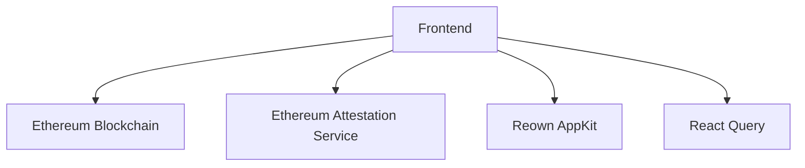

# DeVouch Frontend

## 1. Project Overview

### Purpose

DeVouch is a decentralized verification and attestation platform built on the Ethereum blockchain. The frontend application provides a user-friendly interface for creating, managing, and verifying attestations using the Ethereum Attestation Service (EAS).

### Key Features

-   Web3 wallet integration for secure authentication
-   Attestation creation and management
-   Real-time verification of attestations
-   Responsive and modern UI built with Next.js and Tailwind CSS

### Live Links

-   Production: [https://devouch.xyz/](https://devouch.xyz/)
-   Staging: [https://staging.devouch.xyz/](https://staging.devouch.xyz/)

## 2. Architecture Overview

### System Diagram



### Tech Stack

-   **Framework**: Next.js 16
-   **UI**: React 19, Tailwind CSS 4
-   **State Management**: React Query
-   **Web3 Integration**:
    -   Wagmi
    -   Viem
    -   Reown AppKit (formerly Web3Modal)
-   **Attestation Service**: EAS SDK
-   **Language**: TypeScript

### Data Flow

1. User connects wallet via Reown AppKit
2. Frontend interacts with EAS SDK for attestation operations
3. React Query manages data fetching and caching
4. Wagmi handles blockchain interactions
5. UI components render attestation data and user interactions

## 3. Getting Started

### Prerequisites

-   Node.js 24 LTS (v20.19 or higher is supported; see `.nvmrc`)
-   Yarn 1.x (classic) package manager
-   Web3 wallet (MetaMask, WalletConnect, etc.)

### Installation Steps

1. Clone the repository:

    ```bash
    git clone https://github.com/your-org/devouch-fe.git
    cd devouch-fe
    ```

2. Install dependencies:

    ```bash
    yarn install
    ```

3. Copy environment variables:

    ```bash
    cp .env.example .env.local
    ```

4. Update environment variables in `.env.local` with your configuration

### Configuration

Environment variables (see `.env.example`):

-   `NEXT_PUBLIC_ENV`: `production` selects the Optimism instance, anything else selects the Sepolia (staging) instance
-   `NEXT_PUBLIC_WALLET_CONNECT_ID`: Your Reown (WalletConnect) project ID
-   `NEXT_PUBLIC_EAS_CONTRACT_ADDRESS`: EAS contract address (defaults per instance)
-   `NEXT_PUBLIC_PROJECT_VERIFY_SCHEMA`: EAS schema UID used for vouch/flag attestations
-   `NEXT_PUBLIC_ATTESTATION_FEE`: Fee (in ETH) sent with each attestation
-   `NEXT_PUBLIC_GRAPHQL_ENDPOINT`: Backend GraphQL endpoint (defaults per instance)
-   `NEXT_PUBLIC_DRPC_ENDPOINT`: Optional Ethereum mainnet RPC used for ENS name lookups

## 4. Usage Instructions

### Running the Application

Development mode:

```bash
yarn dev
```

Production build:

```bash
yarn build
yarn start
```

### Testing

Run linting and type checking:

```bash
yarn lint
yarn typecheck
```

### Common Tasks

-   Creating new attestations
-   Verifying existing attestations
-   Managing wallet connections
-   Viewing attestation history

## 5. Deployment Process

### Environments

-   Development: Local development
-   Staging: Pre-production testing
-   Production: Live application

### Deployment Steps

1. Build the application:

    ```bash
    yarn build
    ```

2. Deploy to your hosting platform (e.g., Vercel)

### CI/CD Integration

-   Automated builds on main branch
-   Pre-deployment checks
-   Environment-specific configurations

## 6. Troubleshooting

### Common Issues

1. **Wallet Connection Issues**

    - Clear browser cache
    - Ensure wallet is properly configured
    - Check network connectivity

2. **Attestation Creation Failures**
    - Verify wallet has sufficient funds
    - Check network congestion
    - Ensure correct contract addresses

### Logs and Debugging

-   Browser console logs
-   Network request monitoring
-   Transaction status tracking

## Contributing

Please read [CONTRIBUTING.md](CONTRIBUTING.md) for details on our code of conduct and the process for submitting pull requests.

## License

This project is licensed under the MIT License - see the [LICENSE](LICENSE) file for details.
